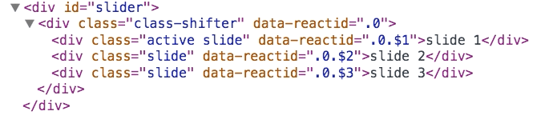

react-class-shifter
===================

A React component that facilitates animations by shifting classes around.


## Usage

Render the component with children:

```jsx
React.render((
  <ClassShifter>
    <div key="1">slide 1</div>
    <div key="2">slide 2</div>
    <div key="3">slide 3</div>
  </ClassShifter>
), sliderNode);
```

The `.active` class will be shifted from one element to the next:




## Props

You can control the speed with `speed={2000}` and disable pausing on hover (on
by default) with `pauseOnHover={false}`.

If you set the prop `callback` to a function, it will be called whenever the
index changes. The function will receive the current index as an argument.
